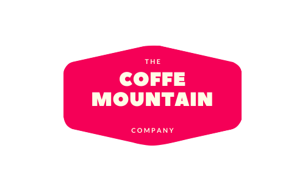

<h1 align="center">Coffe Mountain ( React JS Point of Sales - Web App)</h1>

  

 

Coffe Mountain is an application in the form of a website and a mobile application for product management, category management and has a cashier system (point of sale), this application is made using React Js and React Native. There is only a website model in this area, if you interest and want to try the mobile app version of MSG-Mart, you can visit this link : 
 

Mobile App [Coffe Mountain](https://github.com/nhasoenhasan/React-Native-Point-Of-sales)

## Features
<b> Product Management </b>
 - Create data table 
 - View data product
 - Update product
 - Delete product
 - Search product name, category and Latest update 
 - Sorting product by ascending and descending

 <b> Category Management </b>
 - Create data table 
 - View data category
 - Update category
 - Delete category

<b> Transaction </b>
- Make Transaction
- Edit Quantity
 
## Get Started 
### ( Localhost Version )
 1. Download and Install RESTfull API from [Coffe Mountain API](https://github.com/nhasoenhasan/RESTful-API-for-Point-Of-Sales-App)
 2. Run backend (API) in local with (xampp or other)
 3. Git clone [Coffe Mountain - React Website](https://github.com/nhasoenhasan/Front-End-Point-Of-Sales-React-Js.git) or download zip
 4. Open in your code editor (vscode, atom or other)
 5. Install node modules with type `npm install` or `yarn install`
 6. Run App with type `npm start`

 ### ( Online Version )
 1. Prepare your internet and browser 
 2. You can visit this [LINK](https://coffe-mountain.netlify.com) for Coffe Mountain online web app version

 ## Build with React Hooks & Redux
 

 ## Screenshot from the App

  <h3>Login Page</h3>
  
      <image width="400" src="screenshot/Login.png" />
  
  <h3>Register Page</h3>
  
      <image width="400" src="screenshot/Register.png" />
  
  <h3>Dashboard Page</h3>
  
      <image width="400" src="screenshot/Dashboard.png" />
  
  <h3>Order History Page</h3>
  
      <image width="400" src="screenshot/OrderHistory.png" />
  
  <h3>Manage Product Page</h3>
  
      <image width="400" src="screenshot/ManageProduct.png" />
  
  <h3>Manage Categories Page</h3>
  
      <image width="400" src="screenshot/ManageCategories.png" />
  
  <h3>Cart Page</h3>
  
      <image width="400" src="screenshot/Cart.png" />
  

